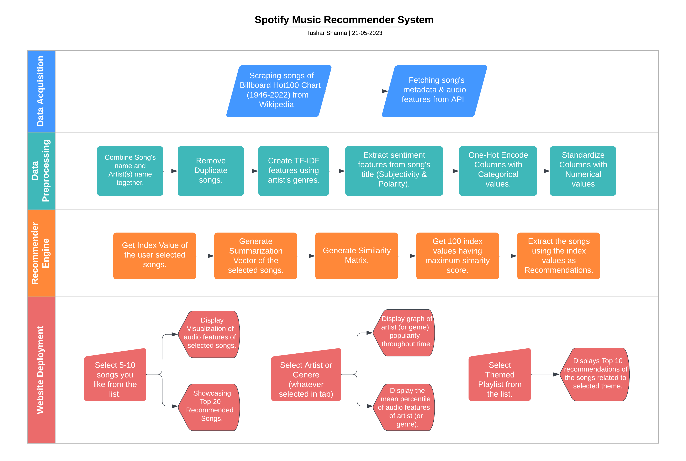

# 
Songs Recommender System

      

## Getting started
To use the application, you can visit the live version hosted on the following URL:

   `https://songs-recommendation-system.streamlit.app/`
    
Alternatively, you can run the application on your local machine by following the steps below:

1. Clone the repository to your local machine by running the following command:  

		git clone https://github.com/tushar-mahalya/Songs-Recommender-System.git
    
2. Create and activate a virtual environment (optional but recommended):
   - Using 'venv':
     
         python3 -m venv venv
         source venv/bin/activate
   - Using 'conda':
     
         conda create --name rec-system-env
         conda activate rec-system-env
     
3. Install the necessary dependencies by running the following command:

		pip install -r requirements.txt

4. Start the Streamlit application by running the following command:

		streamlit run app.py
    
5. Open your web browser and navigate to the following URL:

		http://localhost:8501/

## Introduction
We aim to develop a robust system that combines data acquisition, exploratory data analysis, content-based recommendation algorithms, and user interface development to delve into the evolving landscape of music preferences.

* ### Data Acquisition and Processing
  We employ web scraping techniques and the Spotify API to gather metadata, audio features data, and lyrics of Billboard Hot 100 (BBHOT100) tracks spanning 1946 to 2022. This comprehensive dataset forms the basis of our analysis and recommendation system.

* ### Exploratory Data Analysis
  Using Tableau, we conduct extensive analysis on the BBHOT100 dataset. By examining trends, patterns, and correlations, we gain insights into the evolution of music preferences and the factors influencing popularity.

* ### Recommendation System & Analytics
  Our system includes a content-based recommendation system that uses audio feature extraction and sophisticated algorithms to provide personalized song recommendations based on user preferences. Additionally, our advanced analytics engine visualizes audio features, analyzes artist popularity over time, and presents mean percentile rank of artists and genres for user assessment.

* ### UI Development & Deployment
  We create an intuitive UI resembling Spotify and deploy our song recommender system on Streamlit Cloud for widespread accessibility. Users can seamlessly explore music and discover personalized recommendations on this scalable platform.

## Application Features
* ### Recommender Engine

Our application utilizes a comprehensive algorithm to provide users with tailored music recommendations based on their selected 5-10 songs. By analyzing the audio features, key, time signature, subjectivity, and polarity of the song titles (measured using TextBlob), as well as the genre of the artist, we generate a list of 20 songs that closely align with the user's preferences. To further enhance the user experience, we present a PizzaPlot visualization, showcasing the distribution of audio features of the selected songs. This visual representation helps users understand the characteristics of their chosen songs and how they relate to the recommended tracks. To ensure a seamless listening experience, each recommended song is accompanied by a Spotify link, allowing users to effortlessly explore and enjoy the suggested music.  
* ### Analytical Engine
  
| Artist Profile | Genre Profile |
| ----------------- | ----------------- |
|  |  |

In addition to our recommendation system, we have developed an analytical engine that further enhances the understanding of music and artists. Our engine utilizes PizzaPlot, a specialized visualization tool, to present the audio features of user selected songs in an easily digestible format. We also analyze the popularity of specific artists, providing insights into their reach and influence with respect to time. Furthermore, we visualize the mean percentile rank of artists and genres, allowing users to gauge the relative standing of certain attributes.

* ### Themed Playlists

In addition to the personalized song recommendations, our application goes a step further by curating five themed playlists based on the user's mood. Each playlist is meticulously crafted to cater to the user's preferences, leveraging the characteristics of their selected songs. These playlists exhibit specific audio features that are dominant within them, ensuring a cohesive and immersive musical experience. Let's delve into the details of each playlist:

  1. <b>Trending Songs</b> : By prioritizing the 'popularity' factor, we ensure that users stay up-to-date with the latest music trends and discover the hottest hits in real-time.

  2. <b>Dance Party</b> : Designed for those looking to groove and let loose, this playlist emphasizes the highest 'Danceability' factor.

  3. <b>Monday Blues</b> : Intended to counteract the notorious Monday blues, this playlist is curated with songs that possess the lowest 'Valence' factor.

  4. <b>Energizing</b> : Perfect for workouts or moments when an extra boost of energy is needed, this playlist highlights songs with the highest 'Energy' factor.

  5. <b>Positive Vibes</b> : For those seeking an uplifting and optimistic musical experience, this playlist focuses on songs with the highest 'Valence' factor.

## Pipelines & Workflows

## Hardware Specification

For this project I've used [Amazon Sagemaker Studio Lab](https://studiolab.sagemaker.aws/) EC2-Instance which have the following specs -

| Component | Specification |
| --- | --- |
| CPU | Intel® Xeon® Platinum 8259CL |
| Architecture | x86_64 |
| RAM | 16GB |
| Storage | 15GB (AWS S3 Bucket) |
| GPU | NVIDIA® Tesla T4 |
| CUDA Version | 11.4 |
| V-RAM | 15GB |

## Contributing

If you would like to contribute to the project, you can follow the steps below:

1. Fork the repository to your GitHub account.
2. Clone the repository to your local machine.
3. Create a new branch for your changes.
4. Make your changes to the codebase.
5. Push your changes to your forked repository.
6. Create a pull request from your forked repository to the original repository.

## License

This project is licensed under the MIT License. You are free to use, modify and distribute the code as per the license terms.
