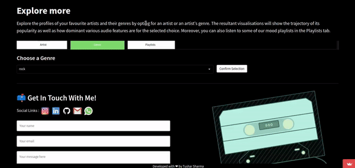
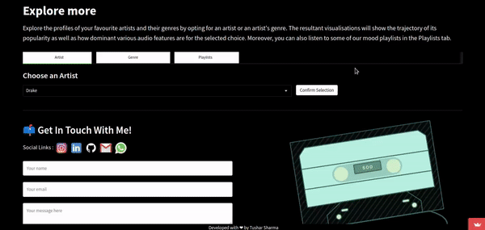

# Songs Recommender System

      

## Getting started
To use the application, you can visit the live version hosted on the following URL:

   `https://songs-recommendation-system.streamlit.app/`
    
Alternatively, you can run the application on your local machine by following the steps below:

1. Clone the repository to your local machine by running the following command:  

		git clone https://github.com/tushar-mahalya/Songs-Recommender-System.git
    
2. Install the necessary dependencies by running the following command:

		pip install -r requirements.txt

3. Start the Streamlit application by running the following command:

		streamlit run app.py
    
4. Open your web browser and navigate to the following URL:

		http://localhost:8501/

## Introduction
In immersive exploration into the evolving landscape of music preferences, our objective is to build a robust system that encompasses a wide range of functionalities, using a combination of data acquisition, exploratory data analysis, content-based recommendation algorithms, and user interface development.

* ### Data Acquisition and Processing
To kickstart our project, we leverage web scraping techniques and the Spotify API to gather metadata, audio features data, and lyrics of Billboard Hot 100 (BBHOT100) tracks spanning 77 years, from 1946 to 2022. This meticulous data collection process ensures a comprehensive and rich dataset for our analysis and recommendation system.
* ### Exploratory Data Analysis
Harnessing the power of business intelligence tools, specifically Tableau, we conduct extensive exploratory data analysis on the processed BBHOT100 dataset. This analysis aims to derive valuable insights into the evolution of music preferences over time. By examining trends, patterns, and correlations within the data, we uncover the shifting dynamics of musical tastes and understand the factors that influence popularity.
* ### Content-Based Recommendation System
Building upon the insights gained from our exploratory analysis, we develop a content-based music recommendation system. By extracting audio features from each song in the dataset, we employ sophisticated algorithms to identify similarities and patterns. This enables us to offer personalized song recommendations to users based on their individual preferences. Our system empowers users to discover new music that aligns with their taste, similar to the acclaimed Spotify recommendation engine.
* ### Advanced Analytics
In addition to our recommendation system, we have developed an analytical engine that further enhances the understanding of music and artists. Our engine utilizes PizzaPlot, a specialized visualization tool, to present the audio features of user selected songs in an easily digestible format. We also analyze the popularity of specific artists, providing insights into their reach and influence with respect to time. Furthermore, we visualize the mean percentile rank of artists and genres, allowing users to gauge the relative standing of certain attributes.
* ### User Interface Development
Delivering a seamless user experience is paramount to our project. With a focus on user-centric design, we craft an intuitive and visually appealing user interface (UI) that emulates the familiar aesthetics of the Spotify platform. Utilizing Streamlit, a powerful web application framework, we build an interactive frontend that seamlessly integrates with our recommendation system. The result is a user-friendly and engaging interface that facilitates effortless music exploration and discovery.
* ### Deployment on Streamlit Cloud
To ensure widespread accessibility, we deploy our song recommender system on Streamlit Cloud. Leveraging the scalability and availability of cloud computing, our system becomes easily accessible to users worldwide via a web browser. This deployment allows music enthusiasts to enjoy personalized recommendations and explore the evolution of music preferences at their convenience.

## Features
* ### Recommender Engine

* ### Analytical Engine
    1. For Genre
    
    2. For Artist
    
* ### Themed Playlists

## Hardware Specification

For this project I've used [Amazon Sagemaker Studio Lab](https://studiolab.sagemaker.aws/) EC2-Instance which have the following specs -

| Component | Specification |
| --- | --- |
| CPU | Intel® Xeon® Platinum 8259CL |
| Architecture | x86_64 |
| RAM | 16GB |
| Storage | 15GB (AWS S3 Bucket) |
| GPU | NVIDIA® Tesla T4 |
| CUDA Version | 11.4 |
| V-RAM | 15GB |

## Contributing

If you would like to contribute to the project, you can follow the steps below:

1. Fork the repository to your GitHub account.
2. Clone the repository to your local machine.
3. Create a new branch for your changes.
4. Make your changes to the codebase.
5. Push your changes to your forked repository.
6. Create a pull request from your forked repository to the original repository.

## License

This project is licensed under the MIT License. You are free to use, modify and distribute the code as per the license terms.
